# Neo4j Graph Database Design

## ER Diagram

```mermaid
    erDiagram

%% Index recommendations (Neo4j):
%%   :Recipe(recipe_id)
%%   :FoodConcept(canonical_key)
%%   :Food(food_key)
%%   :FoodConcept(name) 

%% ==========================================
%% 1. RECIPE
%% ==========================================
    NODE_RECIPE["Recipe (Neo4j :Recipe)"] {
        INTEGER recipe_id PK "NOT NULL"
        STRING source "NOT NULL"
        STRING source_license "NOT NULL"
        STRING Title "NOT NULL"
        STRING Instructions "NOT NULL"
        STRING Image_Name "NOT NULL"
        STRING projection_owner "NOT NULL"
    }

%% ==========================================
%% 2. FOOD CONCEPT
%% ==========================================
    NODE_FOOD_CONCEPT["Food Concept (Neo4j :FoodConcept)"] {
        STRING canonical_key PK "NOT NULL"
        STRING name "NOT NULL"
        STRING status "NOT NULL"
        STRING normalization_version "NOT NULL"
        STRING projection_owner "NOT NULL"
        INTEGER candidate_count "NOT NULL"
        INTEGER cost_ready_count "NOT NULL"
        INTEGER price_reference_count "NOT NULL"
    }

%% ==========================================
%% 3. FOOD
%% ==========================================
    NODE_FOOD["Food (Neo4j :Food)"] {
        STRING food_key PK "NOT NULL"
        STRING source "NOT NULL"
        STRING description "NOT NULL"
        STRING brand_name "NOT NULL"
        STRING brand_owner "NOT NULL"
        STRING ingredients "NULLABLE"
        STRING data_type "NOT NULL"
        FLOAT serving_size "NOT NULL"
        STRING serving_size_unit "NOT NULL"
        STRING household_serving_fulltext "NOT NULL"
        FLOAT energy_kcal "NOT NULL"
        FLOAT protein_g "NOT NULL"
        FLOAT fat_g "NOT NULL"
        FLOAT saturated_fat_g "NOT NULL"
        FLOAT carbohydrate_g "NOT NULL"
        FLOAT fiber_g "NOT NULL"
        FLOAT sugars_g "NOT NULL"
        FLOAT sodium_mg "NOT NULL"
        FLOAT cholesterol_mg "NOT NULL"
        INTEGER fdc_id "NOT NULL"
        STRING nutrition_basis "NOT NULL"
        STRING nutrition_version "NOT NULL"
        STRING nutrition_status "NOT NULL"
        STRING nutrition_source "NOT NULL"
        STRING package_weight "NULLABLE"
        STRING projection_owner "NOT NULL"
    }

%% ==========================================
%% RELATIONSHIP / EDGE ENTITIES
%% ==========================================

    EDGE_REQUIRES["Requires (Neo4j :REQUIRES)"] {
        INTEGER recipe_id FK "NOT NULL"
        STRING normalized_name FK "NOT NULL"
        STRING source "NOT NULL"
        STRING occurrence_id "NOT NULL"
        INTEGER position "NOT NULL"
        STRING raw_text "NOT NULL"
        STRING cleaned_text "NOT NULL"
        STRING projection_owner "NOT NULL"
        STRING quantity_status "NOT NULL"
        BOOLEAN optional "NOT NULL"
        FLOAT quantity "NOT NULL"
        STRING unit "NOT NULL"
        STRING preparation "NULLABLE"
        STRING choice_group "NULLABLE"
        STRING required_state "NULLABLE"
    }

    EDGE_FULFILLS["Fulfills (Neo4j :FULFILLS)"] {
        STRING food_key FK "NOT NULL"
        STRING canonical_key FK "NOT NULL"
        STRING candidate_key "NOT NULL"
        STRING source "NOT NULL"
        STRING kind "NOT NULL"
        FLOAT confidence "NOT NULL"
        STRING match_method "NOT NULL"
        INTEGER nutrition_rank "NOT NULL"
        INTEGER selection_priority "NOT NULL"
        STRING mapping_version "NOT NULL"
        STRING projection_owner "NOT NULL"
        STRING approval_status "NOT NULL"
        STRING price_status "NOT NULL"
        STRING price_basis "NOT NULL"
        STRING freshness_status "NOT NULL"
        STRING price_match_status "NOT NULL"
        FLOAT replacement_factor "NOT NULL"
        BOOLEAN cost_basis_compatible "NOT NULL"
        STRING factor_basis "NOT NULL"
        INTEGER reference_price_minor "NOT NULL"
        STRING price_ref "NOT NULL"
        STRING currency "NOT NULL"
        STRING currency_source "NOT NULL"
        FLOAT package_mass_g "NOT NULL"
        INTEGER package_count "NOT NULL"
        FLOAT package_volume_ml "NOT NULL"
        STRING listing_name "NOT NULL"
        STRING listing_key "NOT NULL"
        STRING retailer "NOT NULL"
        STRING source_snapshot_id "NOT NULL"
        STRING vegetarian_status "NOT NULL"
        STRING vegetarian_policy_version "NOT NULL"
        STRING vegetarian_evidence_kind "NOT NULL"
        LIST vegetarian_concerns "NOT NULL"
        BOOLEAN may_non_vegetarian "NOT NULL"
        STRING halal_status "NOT NULL"
        STRING halal_policy_version "NOT NULL"
        STRING halal_freshness_status "NOT NULL"
        STRING halal_evidence_ref "NOT NULL"
        STRING halal_evidence_kind "NOT NULL"
        STRING allergen_policy_version "NOT NULL"
        STRING allergen_screening_status "NOT NULL"
        LIST allergen_evidence_kinds "NOT NULL"
        BOOLEAN may_allergic "NOT NULL"
        LIST potential_allergens "NOT NULL"
    }

%% ==========================================
%% RELATIONSHIP FLOW (verified against deployed instance)
%% ==========================================
%% Stored direction:
%%   (:Recipe)-[:REQUIRES]->(:FoodConcept)
%%   (:Food)-[:FULFILLS]->(:FoodConcept)
%% Verified empirically on recipe_id 87:
%%   (r:Recipe {recipe_id: 87})-[:REQUIRES]->(fc:FoodConcept)
%%     -[:FULFILLS]->(f:Food)   -> returns no rows
%%   (r:Recipe {recipe_id: 87})-[:REQUIRES]->(fc:FoodConcept)
%%     <-[:FULFILLS]-(f:Food)   -> returns the graph
%% Do not "fix" this arrow back to FoodConcept -> Food.
    NODE_RECIPE ||--o{ EDGE_REQUIRES: "requires"
    EDGE_REQUIRES }o--|| NODE_FOOD_CONCEPT: "resolves_to"
    NODE_FOOD ||--o{ EDGE_FULFILLS: "fulfills"
    EDGE_FULFILLS }o--|| NODE_FOOD_CONCEPT: "resolves_to"
%% Note: :Component and HAS_COMPONENT intentionally excluded.
%% Components only exist for 502/8966 foods (market_acquistion + foundation_food)
%% and are not needed for dietary-app nutrient rollups.

```



## Sample Data

### Sample Recipe Node

```
<id>: 4:88c9edac-c0d2-495c-9955-fd5445d76ca7:206337
Image_Name: "cheesy-sweet-potato-crisps-241136"
Instructions: "Heat oven to 425°F. Finely grate sweet potatoes into a bowl. Squeeze grated sweet potatoes in batches to release as much moisture as possible and place in another bowl; fluff with a fork. Stir in cheese, egg whites, rosemary and pepper. Line a large cookie sheet with parchment paper. Spoon 1 rounded tablespoon batter onto cookie sheet and flatten into a thin, 2- to 2 1/2-inch round. Repeat with remaining batter, leaving 1 inch between rounds. Bake until edges and underside are crisp and browned, 13 to 15 minutes. Remove from oven, let cool slightly and remove from parchment. Serve warm with Rosemary-Balsamic Cream ."
projection_owner: "remy_recipe_graph"
recipe_id: 10234
source: "josephrmartinez/recipe-dataset"
source_license: "CC BY-SA 3.0"
Title: "Cheesy Sweet Potato Crisps"
```

### Sample Food Concept Node

```
<id>: 4:88c9edac-c0d2-495c-9955-fd5445d76ca7:223306
candidate_count: 5
canonical_key: "parmigiano reggiano"
cost_ready_count: 1
name: "parmigiano reggiano"
normalization_version: "recipe-food-v4"
price_reference_count: 1
projection_owner: "remy_recipe_graph"
status: "cost_ready"
```

### Sample Food Node

```
<id>: 4:88c9edac-c0d2-495c-9955-fd5445d76ca7:251939
brand_owner: "Dietz & Watson Inc."
carbohydrate_g: 0.0
cholesterol_mg: 89.0
data_type: "branded_food"
description: "GRATED PARMIGIANO REGGIANO"
energy_kcal: 393.0
fat_g: 28.57
fdc_id: 513462
fiber_g: 0.0
food_key: "fdc:513462"
household_serving_fulltext: "1 Tbsp"
ingredients: "COW'S MILK, SALT, RENNET, CELLULOSE ADDED TO PREVENT CAKING."
nutrition_basis: "per_100g"
nutrition_source: "fooddata_central"
nutrition_status: "validated"
nutrition_version: "fooddata_central:selection_v1:684320fc91ccf6895de090c0fd11ceed097bf16d9d8bec586a27497bf6399a4a"
projection_owner: "remy_recipe_graph"
protein_g: 32.14
saturated_fat_g: 21.43
serving_size: 28.0
serving_size_unit: "g"
sodium_mg: 643.0
source: "fooddata_central"
sugars_g: 0.0
```

### Sample Requires Edge

```
<id>: 5:88c9edac-c0d2-495c-9955-fd5445d76ca7:1161929803373422081
cleaned_text: "2 1/2 ounces finely grated Parmigiano-Reggiano (about 1 cup)"
normalized_name: "parmigiano reggiano"
occurrence_id: "10234:1"
optional: FALSE
position: 1
preparation: "grated"
projection_owner: "remy_recipe_graph"
quantity: 2.5
quantity_status: "known"
raw_text: "2 1/2 ounces finely grated Parmigiano-Reggiano (about 1 cup)"
recipe_id: 10234
source: "josephrmartinez/recipe-dataset"
unit: "ounce"
```

### Sample Fulfills Edge

```
<id>: 5:88c9edac-c0d2-495c-9955-fd5445d76ca7:1152924803141983565
allergen_evidence_kinds: ["fdc_ingredient_text_proxy"]
allergen_policy_version: "allergen_keyword_screen:v1"
allergen_screening_status: "potential_contains"
approval_status: "accepted"
candidate_key: "candidate:6ad5ca7df5b426d091a192de8943a6a0a2c912b1f4adccb11eed1dc999ff928a"
canonical_key: "parmigiano reggiano"
confidence: 1.0
cost_basis_compatible: FALSE
factor_basis: "same_amount"
food_key: "fdc:516627"
freshness_status: "unknown"
halal_freshness_status: "unknown"
halal_policy_version: "halal_screen_v1"
halal_status: "unknown"
kind: "direct"
mapping_version: "recipe_food_to_dbt:v4"
match_method: "exact_normalized_description"
may_allergic: TRUE
may_non_vegetarian: FALSE
nutrition_rank: 4
potential_allergens: ["milk"]
price_basis: "nutrition_only"
price_match_status: "unmatched"
price_status: "unavailable"
projection_owner: "remy_recipe_graph"
replacement_factor: 1.0
selection_priority: 2
source: "fooddata_central"
vegetarian_concerns: []
vegetarian_policy_version: "vegetarian_screen:v1"
vegetarian_status: "unknown"
```
