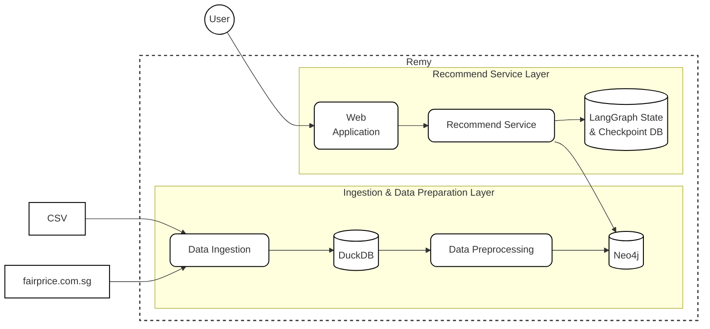

adfa

```mermaid
---
config:
  layout: fixed
---
flowchart LR
 subgraph IngestionLayer["Ingestion & Data Preparation Layer"]
    direction LR
        DI["Data Ingestion"]
        DP["Data Preprocessing"]
        DuckDB[("DuckDB")]
        Neo4j[("Neo4j")]
  end
 subgraph ServiceLayer["Recommend Service Layer"]
    direction LR
        WA["Web<br>Application"]
        RS["Recommend Service"]
        LG[("LangGraph State<br>&amp; Checkpoint DB")]
  end
 subgraph Remy["Remy"]
    direction TB
        IngestionLayer
        ServiceLayer
  end
    CSV["CSV"] --> DI
    Web["fairprice.com.sg"] --> DI
    DI --> DuckDB
    DuckDB --> DP
    DP --> Neo4j
    User(("User")) --> WA
    WA --> RS
    RS --> LG & Neo4j

     DI:::process
     DP:::process
     DuckDB:::database
     Neo4j:::database
     WA:::process
     RS:::process
     LG:::database
     CSV:::input
     Web:::input
     User:::user
    classDef blueLayer fill:#dae8fc,stroke:#6c8ebf,stroke-width:2px,color:#000
    classDef orangeLayer fill:#ffe6cc,stroke:#d79b00,stroke-width:2px,color:#000
    classDef database fill:#fff,stroke:#000,stroke-width:1.5px,shape:cylinder
    classDef process fill:#fff,stroke:#000,stroke-width:1.5px,rx:10,ry:10
    classDef input fill:#fff,stroke:#000,stroke-width:1.5px
    classDef user fill:#fff,stroke:#000,stroke-width:1.5px,shape:circle
    style Remy fill:none,stroke:#333,stroke-width:2px,stroke-dasharray: 5 5
```
