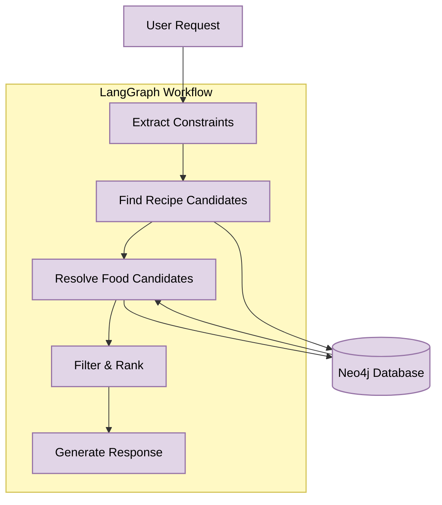

```mermaid
flowchart TD
    %% Define Styles
    classDef requestNode fill:#e1d5e7,stroke:#9673a6,stroke-width:1.5px,color:#000
    classDef workflowNode fill:#e1d5e7,stroke:#9673a6,stroke-width:1.5px,color:#000
    classDef dbNode fill:#e1d5e7,stroke:#9673a6,stroke-width:1.5px,color:#000,shape:cylinder
    classDef layerBox fill:#fff9c4,stroke:#d4c55a,stroke-width:1.5px,color:#000

    %% Nodes
    UR[User Request]:::requestNode
    
    subgraph LGW ["LangGraph Workflow"]
        direction TB
        EC[Extract Constraints]:::workflowNode
        FRC[Find Recipe Candidates]:::workflowNode
        RFC[Resolve Food Candidates]:::workflowNode
        FR[Filter & Rank]:::workflowNode
        GR[Generate Response]:::workflowNode
    end
    
    NEO[(Neo4j Database)]:::dbNode

    %% Connections
    UR --> EC
    EC --> FRC
    FRC --> RFC
    RFC --> FR
    FR --> GR

    %% Interactions with Neo4j
    FRC --> NEO
    NEO --> RFC
    RFC --> NEO

    %% Apply Container Style
    class LGW layerBox
```
